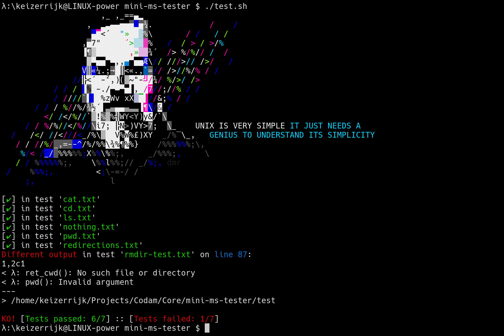

# mini-ms-tester [Work in Progress]
Lightweight tester for the minishell project.
This project aims to automate the process of testing minishell during development.

# Usage
1. Clone this repository.
2. Execute `./test.sh`.
3. Enter the path to your minishell directory or executable.
4. Enter your minishell prefix. In Bash it's `bash`, so you probably use `minishell`.

## Advanced usage
Run `./test.sh cat/cat-me.txt` for the tester to run the `cat/cat-me.txt` test.

Run `./test.sh env cat/cat-me.txt` for the tester to run the tests in the `env` directory and the `cat/cat-me.txt` test.

Run `./test.sh -e` for the tester to exit on the first failed test.
Run `./test.sh -e cat` for the tester to exit on the first failed test in the `cat` directory.

Run `./test.sh -a` for the tester to append `echo a` to the end of every test. This is for example for useful checking whether `exit` didn't immediately exit the tester. You don't always want to enable this option however, since tests like empty.txt will be ruined by appending `echo a` to the end.

Run `./test.sh -m` for the tester *not* to modify the Bash and minishell result files. The modifications are enabled by default since it makes the tester more lenient on Bash-specific error messages and such, but sometimes you might want to compare the unmodified results.

# License
This tester is licensed under the GNU GPLv3 this provides the following four freedoms to the user:
- The freedom to run the program, for any purpose.
- The freedom to study how the program works, and adapt it to your needs.
- The freedom to redistribute copies so you can help your neighbor.
- The freedom to improve the program, and release your improvements to the public, so that the whole community benefits.
